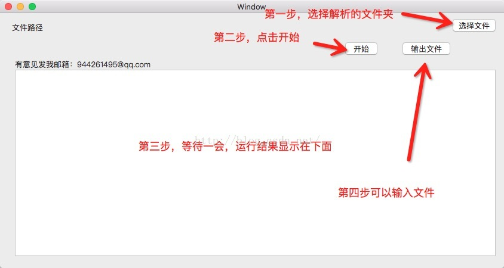

# WMLinkMapAnalyzer linkmap文件分析工具

>iOS App编译之后生成的文件主要包含两部分：资源文件、可执行文件。有时候可能需要分析该可执行文件的组成，这时候可以使用Xcode生成的Link Map File。

自己写的一个关于iOS app的linkmap的分析小软件，方便大家跟容易的分析每个类所占用的大小。

##使用方法：

### 第一步，点击选择文件linkmap的路径

####怎样生成Link Map File?

1. Link Map File在Xcode的默认选项中是不生成的，需要手动打开。具体方法如下：
Xcode->Build Setting->Linking->Write Link Map File设置为YES，并在Path to Link Map File中设置存储路径。

2. 编译后，到如下目录找到该文本文件：
~/Library/Developer/Xcode/DerivedData/xxx/Build/Intermediates/xxx.build/Debug-iphoneos/xxx.build/
文件名如下：
项目名-LinkMap-平台名.txt

### 第二步，点击开始

### 第三步，等待一会儿

### 第四步，可以导出相应的txt文件方便大家分析

参考了；https://github.com/Rick630/LinkMap-Analyze (rick630的源代码)
